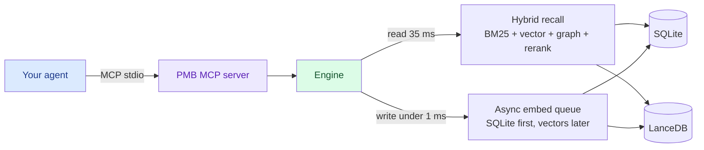

<!-- mcp-name: io.github.oleksiijko/pmb-ai -->

<div align="center">


# PMB

### Local-first memory for your AI coding agent.
### SQLite source of truth. No cloud, no API keys, no re-explaining.

[](https://pypi.org/project/pmb-ai/)
[](https://github.com/oleksiijko/pmb/actions/workflows/ci.yml)
[](https://docs.pmbai.dev)
[](https://pypi.org/project/pmb-ai/)
[](https://github.com/oleksiijko/pmb/actions/workflows/ci.yml)
[](LICENSE)
[](https://modelcontextprotocol.io)
[](https://github.com/mcp/oleksiijko/pmb-ai)


*Local-first memory, visualized. 3,800+ entities and 41,000+ connections, captured automatically as you work.*

[Quickstart](#quickstart) · [Dashboard](#see-your-memory) · [Why pmb-ai?](#why-pmb-ai) · [Demo](#what-it-feels-like) · [How it works](#how-it-works) · [FAQ](#faq)

**Your AI agent forgets everything between sessions.** So you re-explain the same
decisions, lessons and constraints over and over. PMB remembers them in one
local workspace and feeds them back through MCP - no cloud, no API keys, no LLM
call on the read path. SQLite is the source of truth; rebuildable search indexes
stay beside it on your disk. And PMB tells you **when memory is actually
helping**, instead of claiming "+X%".

⭐ **Star the repo if PMB saves you a re-explanation.**

</div>

---

PMB gives Claude Code, Cursor, Codex and the other MCP-aware agents a
real memory. Decisions you made last week. Lessons you taught them.
Personal facts about you. Project structure. PDFs. They survive every
restart, every model upgrade, every agent switch - because they live
in a **local workspace you own**, with SQLite as the durable source of truth.

No API keys. No subscription. No LLM call on the read path. Just local files.

## Quickstart

```bash
pip install pmb-ai                 # 1. install
pmb setup                          # 2. detect your agent + wire the MCP entry
pmb warmup                         # 3. preload the model (first recall is instant)
# 4. restart your agent, then just talk to it - memory is automatic
pmb stats                          # 5. see what's stored
pmb recall "auth decision"         # 6. search memory from the terminal
pmb doctor                         # 7. confirm everything is wired
```

That's it - your agent now remembers. No account, no keys, nothing leaves your machine.

> **Command name:** the CLI is **`pmb`**. Installed via `pip` you also get the
> alias **`pmb-ai`**; installed via `npm` (`npx pmb-ai`) the command is `pmb-ai`.
> Same tool - use whichever your install gave you. From npm, `npx pmb-ai setup`
> runs the full cycle: it installs the Python package, then runs setup.

> **Docs:** [docs.pmbai.dev](https://docs.pmbai.dev) ·
> [Getting started](https://github.com/oleksiijko/pmb/blob/main/docs/guide/getting-started.md) ·
> [Deleting memories](https://github.com/oleksiijko/pmb/blob/main/docs/guide/deleting-memories.md) ·
> [all documentation](https://github.com/oleksiijko/pmb/blob/main/docs/README.md).

---

## See your memory

`pmb dashboard` opens a local, liquid-glass UI over everything PMB captured - written automatically, just by working. It binds to `127.0.0.1` only, so nothing leaves your machine.

<div align="center">


*Map - every entity and connection in your project, as a live graph.*


*Timeline - your memory as a journal, newest first.*

</div>

### Watch: 2-minute setup

<div align="center">
<video src="https://github.com/oleksiijko/pmb/raw/main/docs/assets/setup.mp4" controls width="820"></video>
</div>

https://github.com/user-attachments/assets/c0f454c5-84b3-42d6-b1dc-f694978cd802

Prefer text? The [Quickstart](#quickstart) above is the same flow in seven commands.

---

## Why pmb-ai?

- **Local-first, zero-config.** SQLite holds the durable memory; rebuildable search indexes stay local. No account, API keys, telemetry, or cloud to trust.
- **It actually gets used.** On Claude Code / Codex, hooks inject the right memory *before* the model thinks - you never have to remember to call a tool.
- **Multilingual, no setup.** The embedder covers 50+ languages; a Russian query finds an English fact. No per-language config.
- **MCP-native.** One `pmb connect` wires Claude Code, Cursor, Codex, Windsurf, Zed, VS Code, and more.
- **Fast read path.** Recall in ~35 ms warm; writes return in under a millisecond - no LLM call to remember.
- **Your data, in the open.** `pmb export` dumps everything to Markdown/JSON. Apache 2.0.

---

## What it feels like

<div align="center">


</div>

```
You:    fix that LoadGuard pricing bug we hit last Tuesday

Agent:  prepare(message="fix LoadGuard pricing bug")
        ↓ (6 ms)
        → project_context: 12 events about LoadGuard,
          4 lessons (incl. "never lower NEGOTIATE/SKIP under 25%"),
          3 decisions, 2 open goals
        → active_arcs: "LoadGuard verdict-policy refactor (started Tue)"
        → lessons: 1 directly matches "pricing"
        → recent_activity: 8 commits this week

        Looking at src/engine/verdict-policy.ts (you opened it Tuesday
        14:32, last changed Wednesday). The pricing bug you mentioned
        is on line 142 where the bundle fallback was tightening below
        the rate-floor. Per the lesson you saved, we should never
        drop the threshold under 25% - let me restore the guard there.
```

The agent didn't ask. It didn't guess. It read its memory in **6 ms**
and showed up to the task already informed.

---

## What you can put in there

```bash
# Personal facts that change                  (with time-travel: old
#                                                values archived, never lost)
record_keyed_fact("user", "city", "Warsaw")

# Project structure - symbols, imports, .gitignore-aware
pmb index project .

# Why each file exists + the intent behind every commit (Haiku-summarised, local)
pmb track modules                # one-line purpose per indexed file
pmb track changes                # new commits: what changed and WHY

# PDFs (research papers, manuals, contracts)
pmb index pdf paper.pdf
pmb index pdf ~/docs --recurse

# Whatever your agent decides to log as it works
# (decisions, lessons, completed tasks, goals)
```

PMB is content-agnostic. If it's text the agent will care about later,
PMB will remember and retrieve it.

---

## What the agent gets back

A single MCP call - `prepare(message)` - returns the right things at
the right level of detail, in 4-16 ms:

| Field | What it is |
|---|---|
| `project_context` | Full project overview if the message mentions a project: key facts, lessons (RULES to follow), decisions, open goals, related entities, the project's narrative arc |
| `lessons` | Procedural rules matching the query, each with a `surface_id` so the agent can confirm it followed the rule later |
| `recent_activity` | Last 24 h of decisions / edits / completions for session continuity |
| `open_goals` | In-progress goals so the agent knows what you're pursuing |
| `active_arcs` | Narrative arcs the project is currently living in |

For everything else there's `recall(query)` (hybrid search, 35 ms warm)
and 27 other tools listed in [docs/reference/COMMANDS.md](https://github.com/oleksiijko/pmb/blob/main/docs/reference/COMMANDS.md).

---

## How it works



**Storage** - every durable event lives in SQLite, the source of truth.
Rebuildable vector indexes live in LanceDB beside it. The whole workspace stays
on your disk and can be copied or exported whenever you want.

**Recall** - BM25 (lexical) + dense vector (semantic) + entity graph
+ optional cross-encoder rerank, fused via Reciprocal-Rank-Fusion.

**Writes** - async. The MCP tool returns in under a millisecond. The
actual embed + LanceDB insert happens on a background thread.

**Dedup** - four layers. Exact text match → cosine ≥ 0.92 auto-merge
→ cosine 0.80-0.92 borderline (LLM verify later) → manual review in
the dashboard. Old values get archived, never deleted; full history
is queryable via `keyed_fact_as_of(t)`.

**Multilingual - no language packs.** The default embedder
(`paraphrase-multilingual-MiniLM-L12-v2`) covers 50+ languages, so a
Russian query like *где я живу* finds an English keyed-fact stored as
*user.city = Warsaw* with no translation. Intent detection and keyed
extraction ride **English semantic anchors** that transfer cross-lingually
through the embedder - one mechanism for every language the model knows,
instead of a hand-written pack per language. The cold lexical path then
**self-compiles** from your own traffic (anchor→lexicon distillation), so a
language you actually use gets faster over time with zero configuration.
Recall stays strong across ~11 languages (overall top-3 ≈ 0.9 on a
101-query eval; top-1 = 1.00 for en/fr/pt/ru, CJK weaker on exact top-1).
See [docs/contributing/adding-a-language.md](https://github.com/oleksiijko/pmb/blob/main/docs/contributing/adding-a-language.md).

---

## Install

```bash
pip install pmb-ai
```

Or from source:

```bash
git clone https://github.com/oleksiijko/pmb.git && cd pmb
python -m venv .venv && source .venv/bin/activate
pip install -e .
```

Prime the model once so the first `recall` is fast (the multilingual embedding
model is ~450 MB; without this the very first query pays a one-time cold-start
load):

```bash
pmb warmup
```

> **Running the tests?** Use the venv's Python, not your system Python -
> `.venv/bin/python -m pytest` (or `.venv\Scripts\python.exe -m pytest` on
> Windows). Running bare `pytest` outside the venv just reports missing
> `numpy`/`fastmcp`/`typer` - that's a missing venv, not a broken project.

Wire one or more agents:

```bash
pmb connect claude-code   # Claude Code
pmb connect codex         # OpenAI Codex CLI
pmb connect cursor        # Cursor
pmb connect windsurf gemini vscode zed opencode continue   # also supported
```

Point several agents at the same memory:

```bash
pmb connect claude-code --workspace personal
pmb connect cursor --workspace personal
# both now read/write the same workspace
```

Everything above is **stdio** - the server runs as a child process of your
agent. No network, no port, no token. That's the whole story for one person
on one machine.

> Sharing one memory across machines or a team? That's an optional HTTP
> mode with bearer-token auth - see [docs/guide/TEAM.md](https://github.com/oleksiijko/pmb/blob/main/docs/guide/TEAM.md). You don't
> need it for local use.

Inspect:

```bash
pmb dashboard     # http://127.0.0.1:8765 (graph, timeline, settings, errors)
pmb stats         # quick numbers
pmb doctor        # health check
```

---

## CLI cheat sheet

```bash
# Memory
pmb stats                                  show counts and storage info
pmb recall "query"                          search with full debug
pmb dashboard                               web UI on port 8765 (graph, settings, errors)

# Ingest
pmb index pdf paper.pdf                     extract + chunk + embed
pmb index pdf ~/docs --recurse              entire directory
pmb index project .                         scan codebase
pmb track changes                           summarise commit intent (why)
pmb track modules                           one-line purpose per module
pmb import chatgpt ~/Downloads/export.json  bring existing history

# Continuity & efficiency (opt-in)
pmb resume save                             write .pmb/resume.md (commit it)
pmb resume install                          refresh resume.md at every turn end
pmb health lessons-impact                   which lessons actually help outcomes
pmb memory ledger                           Memory Delta handles this session

# Maintenance
pmb regraph                                 rebuild entity graph
pmb consolidate                             run sleep pass (optional)
pmb compact                                 archive old events
pmb dedupe                                  resolve borderline duplicates

# Hooks (force-feed PMB at the protocol level - no model cooperation)
pmb hooks install claude-code               wire all 4 lifecycle hooks
pmb hooks list                              show what's installed
pmb hooks capabilities                      ambient mechanism each agent supports
pmb hooks uninstall claude-code             remove them
pmb auto-context "fix bug in PMB"           preview per-turn injection
pmb session-restore -m 180                  preview post-compaction restore
pmb lesson-followcheck --dry-run            preview follow-through scoring

# Ambient memory (the write side - memory journals the agent's work)
pmb autowrite --dry-run                     preview ambient auto-write for this turn
pmb ambient-watch .                         ambient auto-write for MCP-only hosts (git observer)
pmb forget-auto                             drop memory the ambient layer wrote itself

# Config
pmb config list                             default tier (25 keys you care about)
pmb config list --pro                       every key, including 80 advanced knobs
pmb config set recall.ppr_enabled true      toggle a feature
pmb connect --rules-only                    refresh CLAUDE.md only
```

Step-by-step per agent: [docs/guide/usage.md](https://github.com/oleksiijko/pmb/blob/main/docs/guide/usage.md). Full command
reference: [docs/reference/COMMANDS.md](https://github.com/oleksiijko/pmb/blob/main/docs/reference/COMMANDS.md).

## Settings - 25 you care about, 80 you don't

PMB has 105 tunables. The 25 that affect day-to-day quality are
**default-tier** - visible in `pmb config list`. The rest are
internal weights, ablation knobs, and experimental flags, hidden
behind `--pro` so the surface stays scannable.

Default-tier highlights:

| Key | Default | What it does |
|---|---|---|
| `recall.top_k` | 5 | How many results recall returns |
| `recall.bm25_weight` | 0.7 | BM25 vs vector mix (1.0 = pure BM25) |
| `recall.ppr_enabled` | **true** | Multi-hop graph diffusion, gated by intent |
| `recall.keyed_fact_boost` | 0.35 | How hard personal-attr facts win on personal queries |
| `recall.rerank` | false | Always-on cross-encoder (regresses LoCoMo, keep off) |
| `embedding.model` | `paraphrase-multilingual-MiniLM-L12-v2` | The vector model |
| `graph.extractor` | `regex` | `regex` / `spacy` / `llm:claude` / `llm:ollama` / `llm:codex` |
| `mcp.record_batch_async` | true | Fire-and-forget writes (sub-ms return) |
| `agent.active_mode` | false | Proactive logging in `pmb connect --active` |
| `agent.apply_lessons` | true | Agent surfaces lessons before acting |
| `agent.log_decisions` | true | Auto-log "we chose X over Y" |
| `agent.log_lessons` | true | Auto-log "we always/never do X" |
| `dedup.enable` | true | All four dedup layers |
| `decay.factor_per_day` | 0.985 | Importance half-life |
| `consolidate.auto_trigger` | false | Run the sleep-pass automatically |
| `chat.model` | `haiku` | Default model for `pmb-chat` |

Pro tier (`pmb config list --pro`) is where you go to tweak the
recall scoring weights (`recall.causation_boost`, `recall.arc_boost`,
`recall.ppr_alpha`), reranker internals (`recall.rerank_top_n`,
`recall.rerank_close_epsilon`), vocab mining
(`recall.auto_vocab_*`), dedup thresholds (`dedup.cosine_high`),
consolidate sleep heuristics, or experimental flags
(`recall.pamvr_enabled`, `recall.adaptive_decompose`,
`recall.typo_correction`).

Every pro-tier key still reads with `pmb config get <key>` and writes
with `pmb config set <key>` - they're hidden from `list`, not gated.

---

## Dashboard

`pmb dashboard` opens a local web UI on port 8765. Nothing leaves
your machine.

Nine tabs: **Map** (entity graph, live), **Timeline** (git-graph by
project), **Overview**, **Entities**, **Arcs** (narrative threads),
**Lessons** (per-rule follow-rate, dead-lesson detection),
**Duplicates** (inline merge), **Performance** (per-tool latency),
**Recall** (debug ranker).

---

## Hooks - memory that doesn't wait to be asked

The hard part of agent memory isn't storing - it's getting the agent to
*use* what's stored. Soft instructions in a rules file get skipped. So
PMB wires four hooks at the protocol level (`pmb hooks install
claude-code`), and each removes a dependency on the model remembering to
act:

- **UserPromptSubmit → auto-recall.** Every message is classified (regex,
  multilingual, sub-ms) and the matching memory is fetched *for* the
  agent - lessons, past decisions, recall hits, project overview - and
  injected before the model thinks. The agent never has to decide to call
  `recall`. Trivial messages inject nothing.
- **PostToolUse → ambient observe.** Every tool the agent runs is appended
  to a lightweight action journal (`pmb track-action` - a single SQLite
  INSERT, no model, no vectors). Reads and `ls` are filtered out; edits,
  tests and commits are kept. This is the raw material the Stop hook turns
  into a memory if the agent never journals its own work.
- **SessionStart → session-restore.** When the context window compacts,
  the agent normally forgets what it just did. This hook rebuilds "where
  you left off" from what the session recorded - decisions, completed
  work, lessons, open goals - so it picks the thread back up instead of
  re-asking you.
- **Stop → follow-through + ambient auto-write.** At turn end PMB does two
  things. (a) *Follow-through:* it checks which surfaced lessons actually
  showed up in what the agent did (token overlap, gated on distinctive
  tokens) and marks them followed - *deterministically*, without the model
  self-reporting. (b) *Ambient auto-write:* if the agent did NOT call a
  `record_*` tool this turn, it synthesizes one activity entry from the
  observed actions, so real work is captured even when the agent stays
  silent. See **Ambient memory** below.

Preview any of them without an agent: `pmb auto-context "..."`,
`pmb session-restore -m 180`, `pmb lesson-followcheck --dry-run`,
`pmb autowrite --dry-run`.

---

## Ambient memory - the write side

Auto-recall fixed the *read* side: the agent no longer has to remember to
call `recall`. **Ambient memory** does the same for the *write* side -
the memory journals the agent's work even when it forgets `record_batch`:

- **Coordinated - never a duplicate.** If the agent already called a
  `record_*` tool this turn, ambient stays silent; the agent's own summary
  is richer. It only fills the gap.
- **Outcome-scored, not churn.** A turn is journaled only if it clears a
  quality bar driven by *results* - tests passed, a failure got fixed, a
  deploy/migrate ran, the breadth of edits - not by how many files were
  touched alone. Two mechanical edits and nothing else are dropped.
- **Honest + reversible.** Every ambient entry is tagged
  `source=autowrite`, shown as auto in the dashboard, and removable in one
  command (`pmb forget-auto`). **ON by default** - capturing work the
  agent forgot is PMB's signature; turn it off with
  `pmb config set autowrite.enabled false`.
- **Works on every host.** Claude Code via the PostToolUse + Stop hooks;
  OpenAI Codex by parsing its session rollout on `agent-turn-complete`
  (`pmb codex-notify`); MCP-only hosts (Cursor, Zed, VS Code) via a git
  observer that watches the working tree (`pmb ambient-watch .`). See what
  your agent supports with `pmb hooks capabilities`.

Synthesis is template-based by default (instant, deterministic, no model).
Opt into a nicer one-line summary from a local/CLI model with `pmb config
set autowrite.synthesizer llm:ollama` (or `llm:claude` / `llm:codex`) - it
has a timeout and falls back to the template, so it never blocks the turn.

---

## Self-improvement loop

Every lesson the agent surfaces carries a `surface_id`. Follow-through is
recorded two ways: the agent can confirm explicitly via
`mark_lesson_followed(surface_id, True)`, mark an irrelevant surface with
`applicable=False`, and the **Stop hook** infers both outcomes automatically
from recorded activity. The **Lessons tab** then shows, per rule:

- How often it was shown to the agent
- How often it was followed (confirmed or auto-detected)
- `💀 DEAD` only when a rule is repeatedly **ignored** (✗ ≥ 2) - surfaced-
  but-unconfirmed is shown as `? UNVERIFIED`, never punished as dead
- `★ USEFUL` for rules followed ≥ 2×

You see which rules actually help and prune the ones that don't.

---

## Numbers

| | |
|---|---|
| Recall p50 / p95 warm | **35 ms / 110 ms** |
| `prepare(message)` warm | **4-16 ms** |
| `record_batch_async` | **&lt; 1 ms** |
| MCP cold boot | **3.7 s** |
| LoCoMo recall@10 (n=10) | **94.5 %** *(reproducible - see below)* |
| Multilingual mega-stress top-10 (900 q) | **99.2 %** |

Reproduce locally:

```bash
python scripts/benchmarks/benchmark_locomo.py --n-conversations 10
python scripts/benchmarks/mega_stress_test.py
```

---

## <a name="privacy"></a>Privacy

- 100 % offline by default. No network calls from the engine.
- Zero telemetry. There is no call-home to add later, because there is
  no PMB server to call.
- Workspace = directory under `~/.pmb/<name>/`. Copy it to Dropbox,
  push it to git, share it on a USB drive. Your call.
- Secrets are auto-redacted at write time (OpenAI / Anthropic / AWS /
  Stripe / GitHub keys; configurable).
- Apache 2.0 licensed. Forks welcome.

---

## FAQ

**Does PMB call an LLM?**
On read: never. On write: never by default. Optional: `pmb consolidate`
can run a local Ollama or Claude CLI pass over recent events to write
short reflections - opt-in, never required.

**What about cost?**
$0. There is no PMB service.

**Does the agent need to know about PMB?**
After `pmb connect`, the right rules are appended to `CLAUDE.md` /
`AGENTS.md` automatically. The default minimal profile exposes 10 core MCP
tools, including the `prepare()` read-first pattern. Wider `default` and `full`
profiles remain available for ingestion, inspection, and administration.

**Will it slow my agent down?**
The MCP tools return in single-digit milliseconds for everything
except `recall` (35-110 ms warm), which is below human perception.

**Can two agents share one memory?**
Yes. Point them at the same workspace with `pmb connect <agent>
--workspace personal`. SQLite's WAL mode + a 10 s busy-timeout (set
automatically) handle the concurrent writes.

**What if I want to wipe a fact?**
`pmb forget <ulid>` archives it. Archives are excluded from recall
but survive on disk - you can always restore. Hard-delete is
`pmb forget <ulid> --hard`.

**Will this work on Windows?**
Yes. PMB is tested on Windows 11, macOS 14, and Ubuntu 22.04. Cyrillic
paths and console encoding are handled.

**What if I leave a project?**
`pmb workspace archive <name>` puts that memory on ice. `pmb workspace
restore <name>` brings it back six months later.

**Does it work with PDFs / code / Markdown?**
PDFs: `pmb index pdf paper.pdf`. Code: `pmb index project .`. Markdown:
`pmb import markdown ~/notes/`. ChatGPT / Claude exports:
`pmb import chatgpt path.json`.

**Cold start is slow.**
First recall after a fresh boot loads the embedding model (~3 s). Run
`pmb warmup` once or just let the prewarm thread on MCP server boot do
its job in the background.

**Roadmap?**
See [docs/ROADMAP.md](https://github.com/oleksiijko/pmb/blob/main/docs/ROADMAP.md). Highlights: hosted backup via
litestream, optional cloud-sync (BYO bucket), tree-sitter for Rust/TS
project indexing, image OCR.

---

## Contributing

Issues and PRs welcome. There's one full-time maintainer; please open
a discussion before a large change so we can align on direction.

```bash
git clone https://github.com/oleksiijko/pmb.git && cd pmb
python -m venv .venv && source .venv/bin/activate
pip install -e ".[dev]"
pytest                  # full suite, ~4 minutes
pytest -k recall        # fast subset, ~12 s
```

License: **Apache 2.0**.
